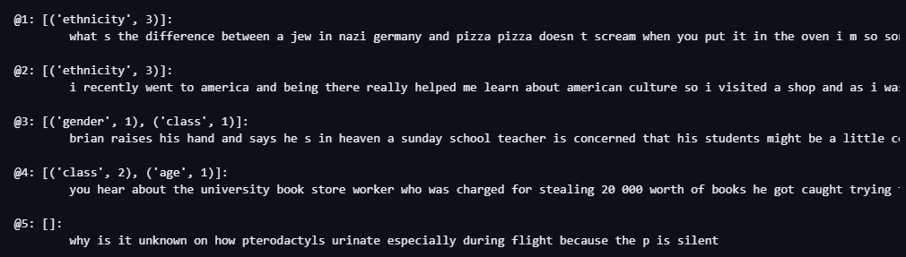
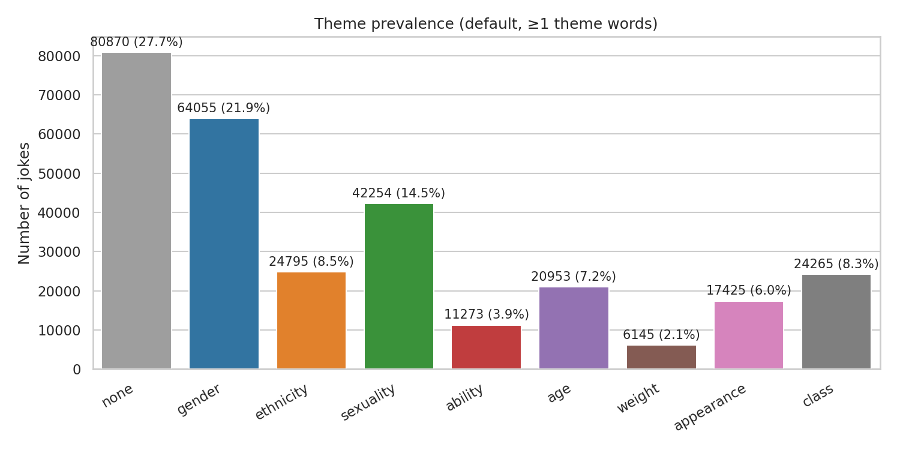
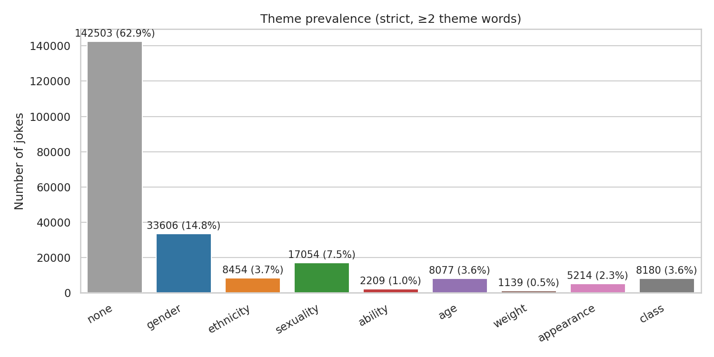
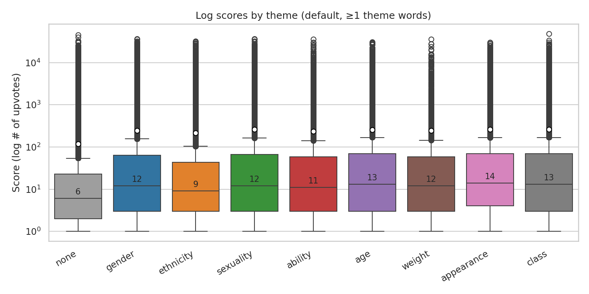
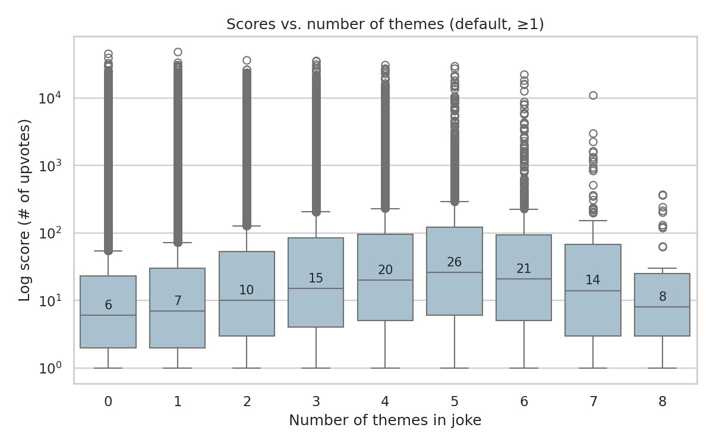
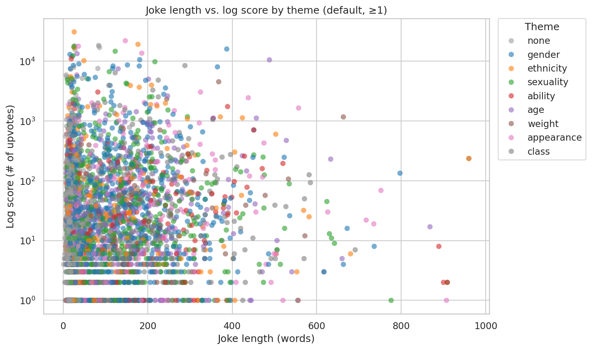

```{python}
#| label: load-packages
#| include: false

# Load packages here
import ast # For ensuring preprocessed data is loaded as intended data types
import numpy as np
import pandas as pd
import seaborn as sns # For making plots
sns.set_theme(context = "notebook", style = "whitegrid")
import os # For saving plots
os.makedirs("./images", exist_ok = True)
import matplotlib.pyplot as plt
from sklearn.calibration import LabelEncoder
from sklearn.preprocessing import MinMaxScaler
from sklearn.decomposition import PCA
from sklearn.model_selection import train_test_split

```

```{python}
#| label: setup
#| include: false
#| 
# Set up plot theme and figure resolution
sns.set_theme(style="whitegrid")
sns.set_context("notebook", font_scale=1.1)

import matplotlib.pyplot as plt
plt.rcParams['figure.dpi'] = 300
plt.rcParams['savefig.dpi'] = 300
plt.rcParams['figure.figsize'] = (6, 6 * 0.618)
```

```{python}
#| label: load-data and merge
#| include: false
# Load Data
preprocessed_df = pd.read_csv(
    "./data/preprocessed_dataset.csv",
    converters={"themes_found": ast.literal_eval})

## MERGE DATAFRAMES
jokes_df = preprocessed_df

#removes ID and creates a copy of the joke df for classification
jokes_model = jokes_df.copy()
jokes_model.drop(columns = ["id", "themes_found"], inplace = True)

```


## Our Dataset

[A dataset of English plaintext jokes](https://github.com/taivop/joke-dataset)

- ~200k jokes from Reddit

- Gathered in 2017 by Taivo Pungas

- Had coluns: id, title, body, score

- Why we chose it:

  - Very complete data (few missing values)

  - Text data with sociological topic


## Our Questions

1. What are the distributions of social categories and marginalised themes represented in jokes?
2. How does each sociological theme relate to the scores users assign- are certain themes rated more highly?
- Can we create a model to predict how well a joke does, through sociological theme alone?

## Our Approach

Identifying sociological themes

  -  8 themes: gender, ethnicity, sexuality, ability, age, weight, appearance, class

  -  Predefined sets of words to match each theme

Key files

  - [preprocessing_data.ipynb](https://github.com/INFO-523-SU25/final-project-howell-xia/blob/main/preprocess_data.ipynb)

    - For data preparation & feature engineering

  - [final_analysis_writeup.ipynb](https://github.com/INFO-523-SU25/final-project-howell-xia/blob/main/final_analysis_writeup.ipynb)

    - For analysis & presenting findings

## Our Data Prep (NLP)

Preprocessing steps

  - Combining joke title & body (whole_text)

  - Lowercasing

  - Removing non-letter characters

  - Removing stop words

Engineering features

  - whole_text, whole_text_normalised_tokens

  - distinct_words

  - overall_length

  - theme_<theme>_count, theme_<theme>_bool, themes_found


## Example Jokes


## Plot 1 - Theme prevalence (Bar)
::: columns
::: {.column width="50%"}

:::

::: {.column width="50%"}

:::
:::
- Most common: gender, ethnicity & sexuality

- Least common: weight, ability

- Default: 28% of jokes have no visible social theme

- Strict: 63% of jokes have only 1 or no theme words


## Plot 2 - Scores by theme (Box)

{width=60%}

- Themeless jokes score much lower (median: 6 upvotes)

- Uncommon themes (appearance, age, class) get highest scores

- Jokes with ethnic-themed words get lower scores, despite being common

  - Social Progress or jokes becoming cover/subtle?


## Plot 3 - Scores by # of themes (Box)



- Clear positive trend: more themes = higher score

- There is a falloff point - joke too long, hard to follow

## Plot 4 - Scores by joke length, by theme (Scatter)



- Longer jokes receive lower scores

- Jokes with no social theme tend to be shorter

- Otherwise no clear trend separating themes here

## Modeling

## Classification

## Results

## Summary & Next Steps

Q1: What are the distributions of themes represented in jokes?

  - Most jokes involve a social theme, especially gender, ethnicity & sexuality

Q2: How does each theme relate to the scores users assign?

  - Reddit users favor jokes with more social themes

**Next steps**

  - Use an LLM for nuanced theme recognition

## Layouts

You can use plain text

::: columns
::: {.column width="40%"}
-   or bullet points[^1]
:::

::: {.column width="60%"}
or in two columns
:::
:::

[^1]: And add footnotes

-   like

-   this

## Code


## Plots


## Plot and text

::: columns
::: {.column width="50%"}
-   Some text

-   goes here
:::

::: {.column width="50%"}

:::
:::

# A new section...

## Tables

If you want to generate a table, make sure it is in the HTML format (instead of Markdown or other formats), e.g.,


## Images

{fig-align="center" width="500"}

## Math Expressions {.smaller}

You can write LaTeX math expressions inside a pair of dollar signs, e.g. \$\\alpha+\\beta\$ renders $\alpha + \beta$. You can use the display style with double dollar signs:

```         
$$\bar{X}=\frac{1}{n}\sum_{i=1}^nX_i$$
```

$$
\bar{X}=\frac{1}{n}\sum_{i=1}^nX_i
$$

Limitations:

1.  The source code of a LaTeX math expression must be in one line, unless it is inside a pair of double dollar signs, in which case the starting `$$` must appear in the very beginning of a line, followed immediately by a non-space character, and the ending `$$` must be at the end of a line, led by a non-space character;

2.  There should not be spaces after the opening `$` or before the closing `$`.
